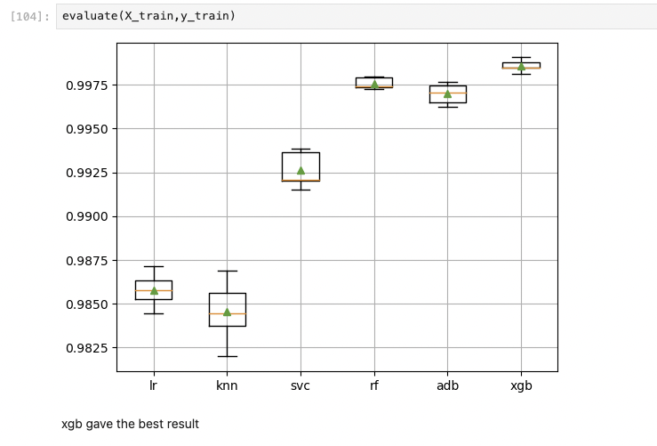
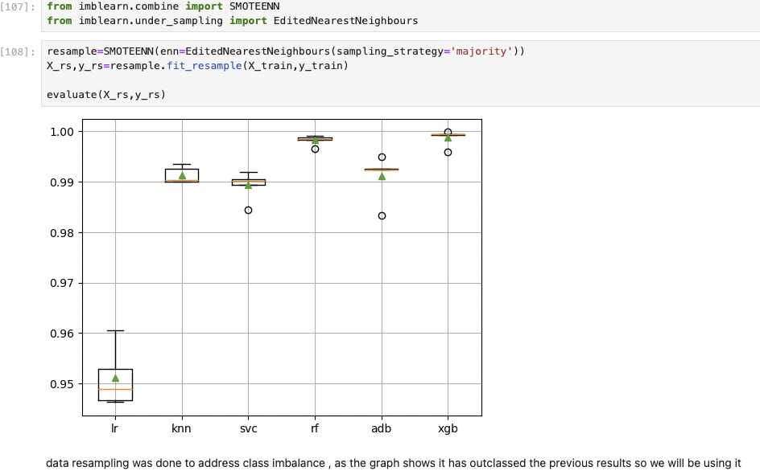
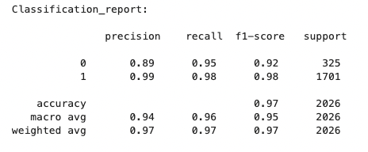

# Credit Card Customer Churn Prediction

## Overview
This repository contains code and resources for predicting credit card customer churn. The project aims to analyze historical customer data and develop machine learning models to predict churn behavior.

## Table of Contents
- [Project Background](#project-background)
- [Data](#data)
- [Methodology](#methodology)
  - [Exploratory Data Analysis](#exploratory-data-analysis)
  - [Feature Engineering](#feature-engineering)
  - [Model Training and Evaluation](#model-training-and-evaluation)
- [Usage](#usage)
- [License](#license)

## Project Background
- This project centers on leveraging machine learning techniques to predict credit card customer churn. 
- By analyzing historical data encompassing transaction behavior, demographics, and usage patterns, the aim is to develop predictive models that identify potential churners. 
- The project seeks to empower financial institutions with proactive insights, enabling targeted retention strategies and enhancing overall customer satisfaction and loyalty in the competitive credit card industry.

## Data
- Data is taken from Kaggle , it contains a csv file "BankChurners.csv".
  - it has 22 feature columns , which gives out various personal information like age ,gender, educationa nd martial status along with their financial activity and status like income and daily/monthly/quaterly usages.
  - it's target column is "Attrition_Flag" which contains binary data indiacting weather the customer is churned or not.
  - no Null entries found in dataset. 
    
- data source, Kaggle://[credit-card-customers](https://www.kaggle.com/datasets/sakshigoyal7/credit-card-customers)
  

## Methodology

### Exploratory Data Analysis
- utilized pie chart and count plot to plot different categorical columns against target column to understand the frequency distribution.
- utilized histogram, boxplot and heatmap to visualize correlation and distribution for various continous datatype columns, to understand outliers
  mean and standard deviation.
- Observations :-
    - There are non-linear relationship between target variable and input variable, also many input variables doesn't have gaussian distribution.
    - Total_Trans_Ct, Total_Trans_Amt, Total_Revolving_Bal,Total_Ct_Chng_Q4_Q1 and Avg_Utilization_Ratio columns seems to have effect on  determining whether a customer leave service or not.
    - data columns like Age and month_on_book variable seems irrevalant to decision whether a customer leave service or not.

### Feature Engineering
- Feature selection done using feature importance method that uses estimator to determine the importance of the variable in determining the value of target variable.
- Because the data contains non-linear,multi-variate complex relations we will use random forest and xgboost.

### Model Training and Evaluation
Utilized K fold cross validation technique with different ML algorithms for training and evaluation .
below are the results.

- Imabalance data:- <br>


- Balanced data:- <br>


XGBClassifier gives the highest accuracy here when compared with other algorithms for both the scenarios.
selected this as a final model.

- classification report for XGBClassifier:- <br>


## Usage
Create a conda environment using environment file , activate that environment and the run the app.py file.
if run sucessfully, you should be able to access the web app at localhost.
you can also explore the notebook file (analysis.ipynb).

Example:-   
```
# clone repo
git@github.com:0x1h0b/CustomerBankData-Segmentation.git

# create environment
conda env create --name <envname> --file=environments.yml

# activate env
conda activate <envname>

# run app.py, for flask based web server
python app.py

```

## License

MIT License | Copyright (c) 2023 Himanshu Bag

A short and simple permissive license with conditions only requiring preservation of copyright and license notices. Licensed works, modifications, and larger works may be distributed under different terms and without source code.

